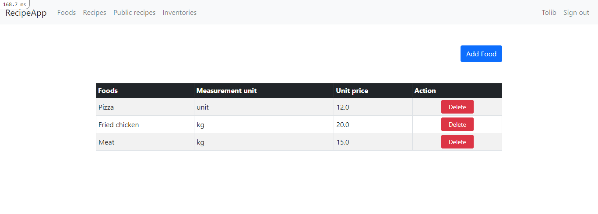

# Recipe app
> The Recipe app keeps track of all your recipes, ingredients, and inventory. It will allow you to save ingredients, keep track of  what you have, create recipes, and generate a shopping list based on what you have and what you are missing from a recipe.

- Built with
- Ruby
- Ruby on Rails
- PostgresSQL
- Bootstrap

## Screenshot

## Getting started
### Prerequisites
- Ruby
- Rspec
- Rails
- PostgreSQL

To get a local copy of this repository kindly follow the steps below.
Kindly make sure you have ruby, Ruby on rails and PostgreSQL installed
Scroll to top of this current repository
Click on the Code button with background color green on the right end corner
Click on the clipboard icon on the extreme right of the dropdown to copy the repository link
In your local PC, open your terminal or command prompt in the folder you would like to clone this repository into
Type git clone (copied link) on the currently opened terminal or command prompt
Remember to change (copied link) to git@github.com:olawale-o/our_recipe_app.git which is the name of the repository

### Setup
- Clone or download this repo on your machine
- Enter project directory
- Run `install bundle` to install dependencies
- Run  `rake db:create` to create a database
- Run  `rake db:migrate` to create a migrations
    
  NOTE Install webpacker
  - rails webpacker:install

### Run

Run `rails s` to run the server and open `localhost:3000` in browser
### Test
  rspec

  ## Authors
👤 **Anderson Caleb**

- GitHub: [@Andersonlebon](https://github.com/andersonlebon)
- Twitter: [@BuyananaCaleb](https://twitter.com/BuyananaCaleb)
- LinkedIn: [@Anderson Caleb](https://www.linkedin.com/in/anderson-caleb-915343209/)

👤 **Sylvestre**

- GitHub: [@sylvestre](https://github.com/pasytchangwa)
- Twitter: [@Sylvestre](https://twitter.com/Sylvest10415595)
- LinkedIn: [Sylvestre Tchangwa](https://www.linkedin.com/in/pagkeusylvestre/)

👤 **Tolib**

- GitHub: [@toliboff](https://github.com/toliboff)
- Twitter: [@toliboff](https://twitter.com/tolib_tolibov)
- LinkedIn: [Tolibjon Tolibov](https://linkedin.com/in/tolibjon-tolibov)

## 🤝 Contributing

Contributions, issues, and feature requests are welcome!

Feel free to check the [issues page](https://github.com/andersonlebon/recipeApp/issues).

## Show your support

Give a ⭐️ if you like this project!

## Acknowledgments

- Microverse